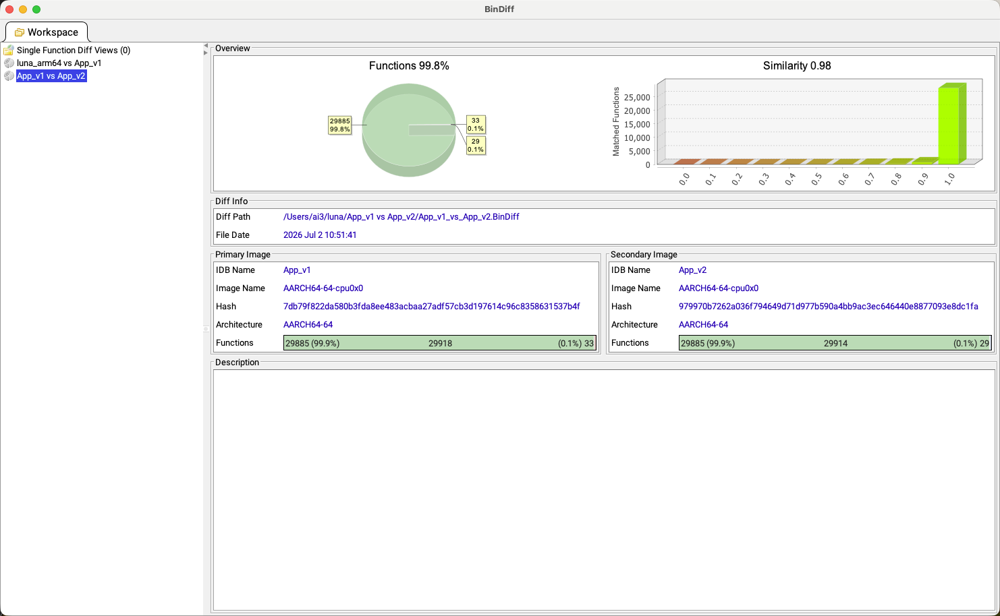
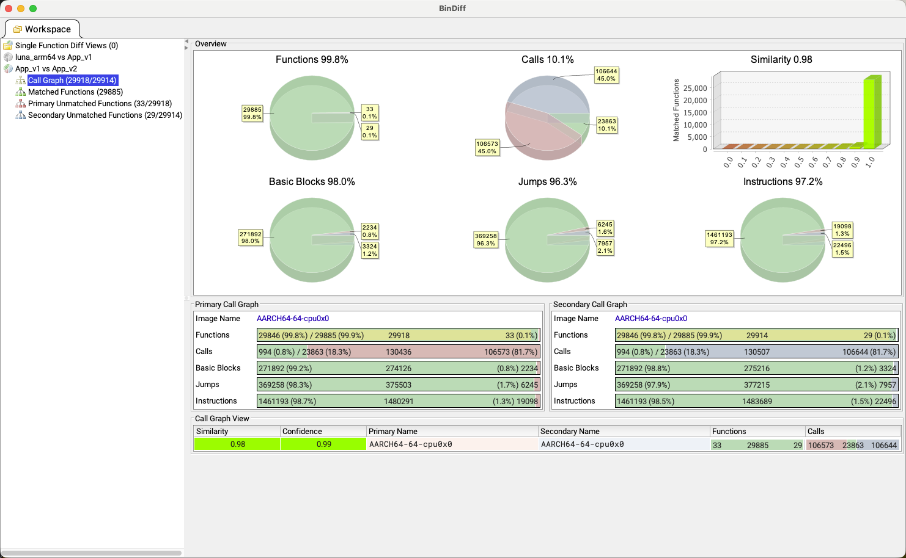
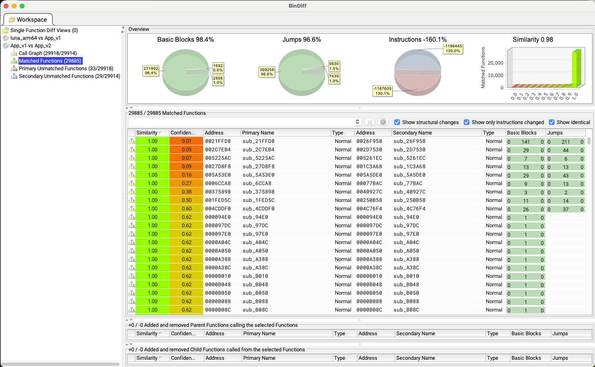
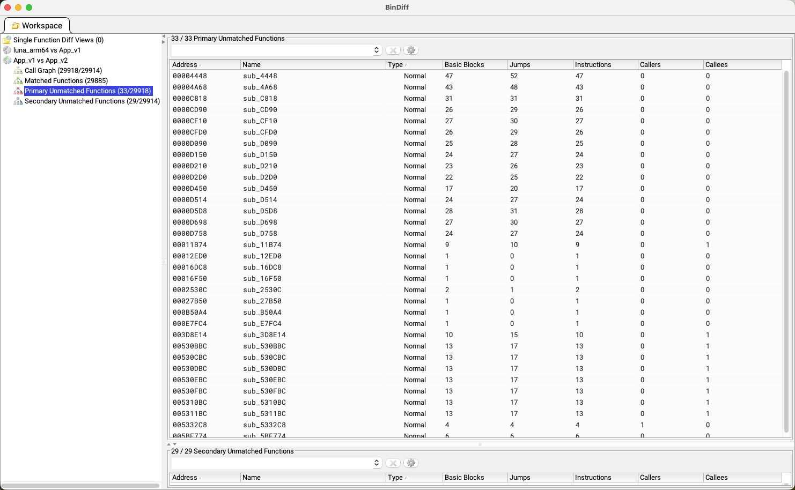
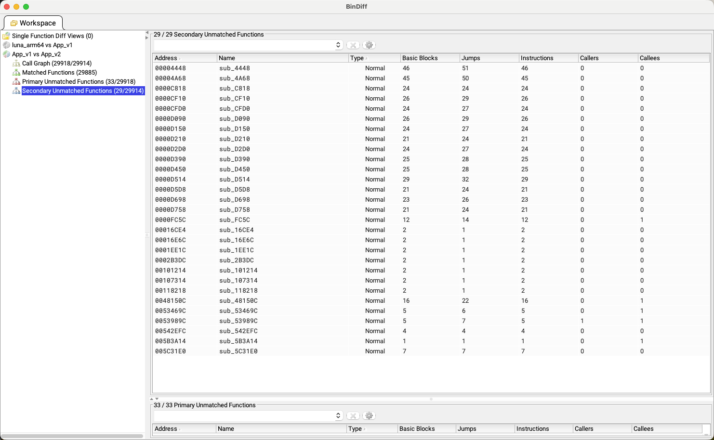

# Flutter iOS IPA 二进制相似度分析新手教程

本文档整理自一次完整排障会话，目标是让新手能够从零完成两份 Flutter iOS `.ipa` 的二进制相似度比对。流程覆盖软件下载、安装、插件配置、`.ipa` 解包、Ghidra 分析、BinExport 导出、BinDiff 对比、结果解读和常见报错处理。

> 适用场景：安全研究、版本差异分析、合规自查、代码重构效果评估。请只分析你有权分析的软件包。

## 0. 你最终会得到什么

完成后，你会得到：

1. 两个从 `.ipa` 中提取出来的 Flutter 核心二进制文件，例如 `App_v1`、`App_v2`。
2. 两个由 Ghidra 导出的 `.BinExport` 文件，例如 `App_v1.BinExport`、`App_v2.BinExport`。
3. 一个由 BinDiff 生成的对比结果，可以查看：
   - 整体相似度 `Similarity`
   - 匹配置信度 `Confidence`
   - 完全匹配函数
   - 修改过的函数
   - 只存在于旧包或新包的函数
   - 控制流图差异

## 1. 原理先讲清楚

`.ipa` 本质上是一个 ZIP 压缩包。Flutter iOS Release 包中，Dart 代码会被 AOT 编译成 ARM64 原生机器码，所以不能直接拿 Dart 源码做比较。

对 Flutter iOS 包做二进制相似度分析时，重点看这些文件：

| 文件 | 路径 | 作用 | 优先级 |
|---|---|---|---|
| Flutter Dart AOT 业务核心 | `Payload/Runner.app/Frameworks/App.framework/App` | Dart 业务代码编译产物 | 最高 |
| iOS 原生宿主壳 | `Payload/Runner.app/Runner` 或实际 App 同名二进制 | AppDelegate、原生插件入口等 | 中 |
| 静态资源 | `Payload/Runner.app/Frameworks/App.framework/flutter_assets/` | 图片、字体、配置、资源 | 中 |

本教程主要分析 `App.framework/App`，因为它通常最能代表 Flutter 业务逻辑。

## 2. 工具选择

推荐使用这套免费工具链：

| 工具 | 用途 | 是否免费 | 备注 |
|---|---|---|---|
| JDK | 运行 Ghidra | 免费 | Ghidra 11.1.2 用 JDK 17；Ghidra 11.2+ 用 JDK 21 |
| Ghidra | 反汇编、自动分析 Mach-O | 免费开源 | NSA 发布 |
| BinExport | Ghidra 导出插件 | 免费开源 | 把 Ghidra 分析结果导出成 BinDiff 可读格式 |
| BinDiff | 二进制相似度比对 | 免费开源版本 | Google 发布 |
| ssdeep | 粗略模糊哈希 | 免费 | 可选，适合快速粗筛 |

## 3. 下载地址

截至 2026-07-02 核对：

| 软件 | 推荐下载地址 |
|---|---|
| Eclipse Temurin JDK | https://adoptium.net/temurin/releases/ |
| Ghidra Releases | https://github.com/NationalSecurityAgency/ghidra/releases |
| Ghidra 11.1.2 | https://github.com/NationalSecurityAgency/ghidra/releases/download/Ghidra_11.1.2_build/ghidra_11.1.2_PUBLIC_20240709.zip |
| BinDiff 8 | https://github.com/google/bindiff/releases/tag/v8 |
| BinExport | https://github.com/google/binexport/releases |

说明：

- Ghidra 最新版可能已经变化，下载前以 GitHub Releases 页面为准。
- Ghidra 11.1.2 官方要求 JDK 17。
- Ghidra 11.2 及之后版本官方要求 JDK 21。
- 会话中已经验证过：如果你的电脑已有 JDK 17，不想升级 JDK，可以使用 Ghidra 11.1.2。

## 4. 推荐版本路线

### 路线 A：新电脑或重新安装，推荐

使用：

- JDK 21
- 最新 Ghidra
- BinDiff 8
- 对应可用的 BinExport 插件

优点：软件更新，Ghidra 新版本功能更完整。

缺点：如果 BinExport 插件版本和 Ghidra 不完全匹配，可能需要额外处理。

### 路线 B：沿用会话中跑通的方案，最适合 JDK 17 用户

使用：

- JDK 17
- Ghidra 11.1.2
- BinDiff 8
- `BinExport_Ghidra-Java.zip`

优点：本教程后面的排障步骤就是围绕这套组合整理的。

缺点：BinExport 的公开包可能显示为适配 Ghidra 11.0.3，在 Ghidra 11.1.2 中可能出现红色版本提示；会话中确认可以继续安装并使用。

## 5. 安装 JDK

### macOS 安装 JDK 21

1. 打开 https://adoptium.net/temurin/releases/
2. 选择：
   - Operating System：`macOS`
   - Architecture：Apple Silicon 选 `aarch64`，Intel Mac 选 `x64`
   - Package Type：`JDK`
   - Version：`21`
3. 下载 `.pkg` 安装包并双击安装。
4. 安装完成后打开终端，执行：

```bash
java -version
```

如果看到类似 `openjdk version "21..."`，说明安装成功。

查看 JDK 21 的安装路径：

```bash
/usr/libexec/java_home -v 21
```

通常会输出：

```text
/Library/Java/JavaVirtualMachines/temurin-21.jdk/Contents/Home
```

### macOS 已有 JDK 17

如果你执行：

```bash
java -version
```

看到类似：

```text
openjdk version "17.0.15"
```

那么你可以选择安装 Ghidra 11.1.2，避免升级 JDK。

## 6. 安装 Ghidra

### 下载 Ghidra 11.1.2

如果你使用 JDK 17，下载：

```text
ghidra_11.1.2_PUBLIC_20240709.zip
```

下载地址：

```text
https://github.com/NationalSecurityAgency/ghidra/releases/download/Ghidra_11.1.2_build/ghidra_11.1.2_PUBLIC_20240709.zip
```

### 解压

建议解压到一个路径简单、没有中文、没有特殊字符的位置，例如：

```text
$HOME/Downloads/ghidra_11.1.2_PUBLIC/
```

不要放在路径带 `!` 的目录下。

### macOS 移除隔离属性

macOS 可能拦截 Ghidra 的原生组件。建议第一次启动前执行：

```bash
sudo xattr -r -d com.apple.quarantine "$HOME/Downloads/ghidra_11.1.2_PUBLIC/"
```

把路径换成你自己的 Ghidra 解压路径。

### 启动 Ghidra

进入 Ghidra 目录：

```bash
cd "$HOME/Downloads/ghidra_11.1.2_PUBLIC"
./ghidraRun
```

如果出现：

```text
JDK 21+ (64-bit) could not be found and must be manually chosen!
Enter path to JDK home directory:
```

说明你运行的是需要 JDK 21 的 Ghidra 版本，例如 Ghidra 12.x。解决方法二选一：

1. 安装 JDK 21，并输入 `/usr/libexec/java_home -v 21` 输出的路径。
2. 换成 Ghidra 11.1.2，使用现有 JDK 17。

## 7. 安装 BinDiff

1. 打开 BinDiff 8 下载页：

```text
https://github.com/google/bindiff/releases/tag/v8
```

2. macOS 下载：

```text
BinDiff8.dmg
```

3. 双击 `.dmg` 安装。
4. 安装完成后，打开 BinDiff 客户端。
5. 如果 BinDiff 弹窗要求设置 IDA directory，而你没有 IDA，可以先点 `Cancel`。我们后面会通过 `.BinExport` 文件进行比对，不依赖 IDA。

## 8. 安装 BinExport 插件到 Ghidra

BinExport 是关键插件。没有它，Ghidra 不能导出 BinDiff 需要的 `.BinExport` 文件。

### 下载 BinExport

打开：

```text
https://github.com/google/binexport/releases
```

下载：

```text
BinExport_Ghidra-Java.zip
```

会话中正确文件大小约为：

```text
3822887 字节，约 3.65 MB
```

如果你的 `BinExport_Ghidra-Java.zip` 只有 100 KB 左右，大概率是坏包或下错文件，请重新下载。

检查文件大小：

```bash
ls -l "$HOME/Downloads/BinExport_Ghidra-Java.zip"
```

### 方法 1：通过 Ghidra 图形界面安装

1. 启动 Ghidra。
2. 点击菜单：

```text
File -> Install Extensions...
```

3. 点击右上角绿色加号 `+`。
4. 选择刚下载的：

```text
BinExport_Ghidra-Java.zip
```

5. 如果弹出版本不匹配，例如插件写着适配 Ghidra 11.0.3，而你是 Ghidra 11.1.2：

```text
Extension Version Mismatch
```

可以点击：

```text
Install Anyway
```

6. 回到扩展列表后，勾选 `BinExport`。
7. 点击 `OK`。
8. 完全退出并重新启动 Ghidra。

### 方法 2：Ghidra 看不到 zip 文件时

如果文件明明存在，但 Ghidra 的文件选择器里看不到：

1. 检查文件名是否变成了双后缀：

```text
BinExport_Ghidra-Java.zip.zip
```

如果是，改回：

```text
BinExport_Ghidra-Java.zip
```

2. 不要把文件放在 Ghidra 自带扩展目录里，先复制到 Downloads 根目录：

```bash
cp "$HOME/Downloads/ghidra_11.1.2_PUBLIC/Extensions/Ghidra/BinExport_Ghidra-Java.zip" "$HOME/Downloads/"
```

3. 在 `File -> Install Extensions... -> +` 里，从 `Downloads` 目录选择它。

### 方法 3：zip 能解压但 GUI 安装异常

如果 Ghidra 对 zip 扫描异常，可以先手动解压检查结构：

```bash
mkdir -p /tmp/binexport_out
unzip "$HOME/Downloads/BinExport_Ghidra-Java.zip" -d /tmp/binexport_out/
ls -l /tmp/binexport_out/
```

正常插件目录中应该能看到类似：

```text
extension.properties
Module.manifest
```

如果解压后第一层又套了一层目录，就进入内部真正包含 `extension.properties` 的目录。

也可以把解压后的插件复制到 Ghidra 用户扩展目录：

```bash
mkdir -p ~/.ghidra/.ghidra_11.1.2_PUBLIC/Extensions/
cp -r /tmp/binexport_out/* ~/.ghidra/.ghidra_11.1.2_PUBLIC/Extensions/
```

然后重启 Ghidra，再去：

```text
File -> Install Extensions...
```

检查 `BinExport` 是否出现并勾选。

### 验证 BinExport 是否安装成功

1. 在 Ghidra 中打开任意已导入的程序。
2. 点击：

```text
File -> Export...
```

3. 查看 `Format` 下拉框。
4. 如果能看到：

```text
BinExport (Protocol Buffer)
```

说明插件安装成功。

## 9. 准备两个 IPA

假设你有两个包：

```text
v1.ipa
v2.ipa
```

建议建立工作目录：

```bash
mkdir -p ~/Desktop/flutter_diff_work/v1
mkdir -p ~/Desktop/flutter_diff_work/v2
mkdir -p ~/Desktop/flutter_diff_work/bin
mkdir -p ~/Desktop/flutter_diff_work/export
```

把两个 `.ipa` 放进去：

```text
~/Desktop/flutter_diff_work/v1/v1.ipa
~/Desktop/flutter_diff_work/v2/v2.ipa
```

## 10. 解包 IPA 并提取 Flutter 核心二进制

### 命令行方式

```bash
cd ~/Desktop/flutter_diff_work/v1
cp v1.ipa v1.zip
unzip v1.zip

cd ~/Desktop/flutter_diff_work/v2
cp v2.ipa v2.zip
unzip v2.zip
```

解压后会看到：

```text
Payload/
```

进入 App 包：

```bash
find ~/Desktop/flutter_diff_work/v1/Payload -maxdepth 3 -type f | head
```

Flutter AOT 业务核心通常在：

```text
Payload/Runner.app/Frameworks/App.framework/App
```

但 App 名可能不是 `Runner`，所以建议用命令查找：

```bash
find ~/Desktop/flutter_diff_work/v1/Payload -path "*/Frameworks/App.framework/App" -type f
find ~/Desktop/flutter_diff_work/v2/Payload -path "*/Frameworks/App.framework/App" -type f
```

复制出来并重命名：

```bash
cp ~/Desktop/flutter_diff_work/v1/Payload/*.app/Frameworks/App.framework/App ~/Desktop/flutter_diff_work/bin/App_v1
cp ~/Desktop/flutter_diff_work/v2/Payload/*.app/Frameworks/App.framework/App ~/Desktop/flutter_diff_work/bin/App_v2
```

如果上面的通配符失败，就使用 `find` 输出的完整路径手动复制。

### Finder 图形方式

1. 把 `v1.ipa` 改名为 `v1.zip`。
2. 双击解压，得到 `Payload` 文件夹。
3. 进入 `Payload`，找到 `xxx.app`。
4. 右键 `xxx.app`，选择 `显示包内容`。
5. 进入：

```text
Frameworks/App.framework/
```

6. 找到没有后缀名的 `App` 文件。
7. 复制出来，重命名为 `App_v1`。
8. 对 `v2.ipa` 重复，得到 `App_v2`。

### 必做：确认格式并抽取 arm64 Mach-O

从 `.ipa` 里复制出来的 `App.framework/App` 不一定就是“可以直接拖进 Ghidra 的单架构 Mach-O”。它可能是一个 Mach-O universal/fat 容器。即使里面只有一个 `arm64` 架构，Ghidra 如果按 `Single file` 导入，也可能把 fat 容器头 `CA FE BA BE` 当成 Raw Binary，导致后面分析全部跑偏。

所以复制出 `App_v1`、`App_v2` 后，必须先执行：

```bash
file ~/Desktop/flutter_diff_work/bin/App_v1
file ~/Desktop/flutter_diff_work/bin/App_v2
```

常见结果有两种：

```text
Mach-O 64-bit dynamically linked shared library arm64
```

这种是单架构 Mach-O，通常可以直接导入 Ghidra。

```text
Mach-O universal binary with 1 architecture: [arm64:Mach-O 64-bit dynamically linked shared library arm64]
```

这种是 universal/fat 容器。虽然只有一个 `arm64`，也建议先抽出真正的 arm64 Mach-O，再导入 Ghidra。

抽取命令：

```bash
lipo ~/Desktop/flutter_diff_work/bin/App_v1 -thin arm64 -output ~/Desktop/flutter_diff_work/bin/App_v1_arm64
lipo ~/Desktop/flutter_diff_work/bin/App_v2 -thin arm64 -output ~/Desktop/flutter_diff_work/bin/App_v2_arm64
```

再确认一次：

```bash
file ~/Desktop/flutter_diff_work/bin/App_v1_arm64
file ~/Desktop/flutter_diff_work/bin/App_v2_arm64
xxd -l 16 ~/Desktop/flutter_diff_work/bin/App_v1_arm64
```

正确的单架构 Mach-O 通常应显示：

```text
Mach-O 64-bit dynamically linked shared library arm64
```

文件头通常类似：

```text
cffa edfe ...
```

后续统一使用 `App_v1_arm64` 和 `App_v2_arm64` 导入 Ghidra。不要再使用原始 universal/fat 容器。

实际例子：

```bash
mkdir -p /Users/ai3/Downloads/bindiff_extract
lipo -thin arm64 /Users/ai3/Downloads/luna -output /Users/ai3/Downloads/bindiff_extract/luna_arm64
file /Users/ai3/Downloads/bindiff_extract/luna_arm64
```

输出如果是：

```text
Mach-O 64-bit dynamically linked shared library arm64
```

就说明抽取成功。

## 11. 在 Ghidra 中创建项目

1. 启动 Ghidra：

```bash
cd "$HOME/Downloads/ghidra_11.1.2_PUBLIC"
./ghidraRun
```

2. 点击：

```text
File -> New Project...
```

3. 选择：

```text
Non-Shared Project
```

4. 项目名建议：

```text
FlutterDiff
```

5. 点击 `Finish`。

## 12. 导入两个二进制文件

1. 从 Finder 里把抽取后的单架构文件拖进 Ghidra 项目窗口：

```text
App_v1_arm64
App_v2_arm64
```

2. Ghidra 会弹出导入确认。
3. 正常情况下会识别为：

```text
Format: Mac OS X Mach-O
Language: AARCH64 或 ARM:LE:64:v8
```

4. 保持默认，点击 `OK`。
5. 导入后，Ghidra 项目白色区域中应能看到 `App_v1_arm64` 和 `App_v2_arm64`。

如果 Ghidra 弹出：

```text
Container File Detected
```

说明你拖入的仍可能是容器文件。不要直接选 `Single file` 继续分析 fat 外壳。更稳妥的做法是回到终端先执行 `lipo -thin arm64`，抽出单架构 Mach-O 后再导入。

如果导入窗口里 `Format` 显示为：

```text
Raw Binary
```

也不要继续。取消导入，重新检查你拖入的文件是否已经经过 `lipo -thin arm64` 抽取。正确导入时应识别为 `Mac OS X Mach-O`。

## 13. 对 App_v1_arm64 做自动分析

1. 在 Ghidra 项目列表中双击 `App_v1_arm64`。
2. 会打开 `CodeBrowser`。
3. 如果弹出：

```text
App_v1_arm64 has not been analyzed. Would you like to analyze it now?
```

点击 `Yes`。

4. 在 `Auto Analyze` 配置窗口中保持默认选项。
5. 点击 `Analyze`。
6. 等待右下角进度条跑完。

重要：

- Flutter AOT 二进制函数很多，分析可能需要 10 到 30 分钟。
- 不要看到界面能点就以为分析完了。
- 一定要等右下角进度条完全消失或变灰。

分析完成后保存：

```text
File -> Save
```

或按：

```text
Cmd + S
```

然后关闭 `App_v1_arm64` 的 CodeBrowser 窗口。

## 14. 对 App_v2_arm64 做自动分析

回到 Ghidra 主项目窗口，对 `App_v2_arm64` 重复同样步骤：

1. 双击 `App_v2_arm64`。
2. 弹窗询问是否分析时，点 `Yes`。
3. 保持默认分析选项。
4. 点 `Analyze`。
5. 等右下角进度条彻底结束。
6. `Cmd + S` 保存。
7. 关闭窗口。

如果你之前误点了 `No`，可以手动触发：

```text
Analysis -> Analyze All...
```

然后点击 `Analyze`。

## 15. macOS 拦截 decompile 时怎么办

分析时 macOS 可能弹窗拦截 `decompile`，提示不是来自明确开发者。

处理步骤：

1. 弹窗里不要点“移到废纸篓”。
2. 点击“完成”或关闭弹窗。
3. 打开：

```text
系统设置 -> 隐私与安全性
```

4. 在安全性区域找到关于 `decompile` 被阻止的提示。
5. 点击：

```text
仍要打开
```

6. 输入 Mac 密码确认。
7. 回到终端执行：

```bash
sudo xattr -r -d com.apple.quarantine "$HOME/Downloads/ghidra_11.1.2_PUBLIC/"
```

8. 重启 Ghidra。
9. 重新打开文件并执行：

```text
Analysis -> Analyze All...
```

如果再次弹窗问是否打开 `decompile`，点击“打开”。

## 16. Ghidra 分析警告如何看

分析 Flutter 文件时，可能看到类似：

```text
Unable to demangle symbol: _kDartVmSnapshotInstructions...
```

这通常不是失败。原因是 Ghidra 默认 demangler 更偏 C++ 符号，而 Flutter/Dart AOT 里存在 Dart VM Snapshot 相关符号。只要分析进度条已经跑完，并且可以正常导出 BinExport，就可以忽略这类警告。

## 17. 导出 App_v1.BinExport

1. 在 Ghidra 主项目中重新双击 `App_v1_arm64`。
2. 确认它已经分析完成。
3. 点击：

```text
File -> Export...
```

4. `Format` 选择：

```text
BinExport (Protocol Buffer)
```

5. 输出路径建议：

```text
~/Desktop/flutter_diff_work/export/App_v1.BinExport
```

6. 点击 `OK`。

## 18. 导出 App_v2.BinExport

对 `App_v2_arm64` 重复：

```text
File -> Export... -> Format: BinExport (Protocol Buffer)
```

输出为：

```text
~/Desktop/flutter_diff_work/export/App_v2.BinExport
```

检查文件是否生成：

```bash
ls -lh ~/Desktop/flutter_diff_work/export/
```

应该看到：

```text
App_v1.BinExport
App_v2.BinExport
```

## 19. 使用 BinDiff 图形界面对比

1. 打开 BinDiff。
2. 如果弹出 IDA directory 配置，可以点 `Cancel`。
3. 点击：

```text
File -> New Workspace...
```

4. 保存一个工作区，例如：

```text
~/Desktop/flutter_diff_work/flutter_diff.BinDiffWorkspace
```

5. 在 Workspace 界面中创建新对比。入口通常有两个：

```text
Diff -> New Diff
```

或在 Workspace 空白处/节点上右键：

```text
New Diff...
```

6. 在 `New Diff` 弹窗中选择两个 Ghidra 导出的 `.BinExport` 文件：

```text
Primary file:   App_v1.BinExport
Secondary file: App_v2.BinExport
```

7. `Diff Destination` 通常会自动生成。如果没有自动生成，选择一个输出目录即可，例如：

```text
~/Desktop/flutter_diff_work/export/
```

8. 点击 `Diff`。

等待完成后，BinDiff 会打开比对结果。

### 已有 .BinDiff 结果如何加入 Workspace

如果你已经用命令行生成了 `.BinDiff` 文件，或者别人发给你一个 `.BinDiff` 文件，不要用：

```text
File -> Open Workspace...
```

直接选 `.BinDiff`。这个窗口只能选 `.BinDiffWorkspace`，所以 `.BinDiff` 会变灰不可选。

正确做法是先打开或新建一个 Workspace，然后使用：

```text
Diff -> Add Existing Diff...
```

选择已有的：

```text
xxx.BinDiff
```

加入后就可以在 Workspace 里双击查看。

## 20. 使用命令行 BinDiff 对比（备用）

图形界面 `New Diff...` 是推荐方式。只有在 UI 无法正常创建 Diff、需要批处理、或者想保存完整终端日志时，才使用命令行。

先找到 BinDiff 可执行文件：

```bash
find /Applications/BinDiff -path "*Contents/MacOS/bin/bindiff" -type f 2>/dev/null
```

macOS 上真正的命令行工具通常是：

```text
/Applications/BinDiff/BinDiff.app/Contents/MacOS/bin/bindiff
```

执行：

```bash
mkdir -p "$HOME/Desktop/flutter_diff_work/export"

/Applications/BinDiff/BinDiff.app/Contents/MacOS/bin/bindiff \
  --primary="$HOME/Desktop/flutter_diff_work/export/App_v1.BinExport" \
  --secondary="$HOME/Desktop/flutter_diff_work/export/App_v2.BinExport" \
  --output_dir="$HOME/Desktop/flutter_diff_work/export"
```

注意不要误用下面这个图形界面启动器：

```text
/Applications/BinDiff/BinDiff.app/Contents/MacOS/bindiff
```

它只支持 `--ui`，不支持 `--primary`、`--secondary`。

命令行运行后会生成 `.BinDiff` 结果文件。要查看结果，先打开一个 `.BinDiffWorkspace`，再通过：

```text
Diff -> Add Existing Diff...
```

把 `.BinDiff` 加入工作区。

## 21. 如何看懂 BinDiff 结果

常见关键指标：

| 指标 | 含义 |
|---|---|
| Similarity | 相似度，0.0 到 1.0，越高越相似 |
| Confidence | 匹配置信度，越高表示工具越确定 |
| Matched Functions | 两边都找到对应关系的函数 |
| Primary Only | 只在旧包或主文件中存在的函数 |
| Secondary Only | 只在新包或次文件中存在的函数 |
| Basic Blocks | 基本块，反映控制流结构 |
| Call Graph | 调用图 |
| Matches | 函数匹配明细 |

一般理解：

- `Similarity = 1.0`：几乎完全一致。
- `Similarity = 0.9+`：高度相似。
- `Similarity = 0.6 ~ 0.8`：中等相似，需要看具体业务函数。
- `Similarity` 很低：差异明显。

不要只看总分。Flutter 包里包含大量 Flutter 引擎、Dart 基础库和第三方 SDK。如果两个 App 使用相同 Flutter 版本和相同第三方库，总体相似度可能被这些共同代码抬高。

### 截图实战解读

下面几张图是一次实际 BinDiff 结果。阅读时建议按顺序看：先看整体总览，再看 Call Graph，再看 Matched / Unmatched 函数。

#### 图 1：Workspace 总览页



这张图用于快速判断“两个包整体有多像”。

重点看：

- 左侧 Workspace 树：当前选中的是 `App_v1 vs App_v2`，说明这是这两个导出结果之间的比对。
- `Functions 99.8%`：函数匹配比例极高。图中 29885 个函数匹配，占 99.8%；只有 33 个 Primary Only 和 29 个 Secondary Only。
- `Similarity 0.98`：整体相似度为 0.98，属于高度相似。
- 下方 `Primary Image` / `Secondary Image`：确认两边架构都是 `AARCH64-64`，函数数量也接近，说明这次比对对象是同类 iOS arm64 二进制。

怎么判断：

- 如果 `Similarity` 接近 1.0，说明二进制结构高度相似。
- 但 Flutter 场景不能只看这个总分，因为 Flutter 引擎、Dart 基础库和相同 SDK 会带来大量共同代码。

#### 图 2：Call Graph 总览页



这张图比总览页更细，展示函数、调用关系、基本块、跳转、指令几个维度。

重点看：

- `Functions 99.8%`：绝大多数函数能匹配。
- `Basic Blocks 98.0%`：基本块相似度很高，说明控制流结构大面积重合。
- `Jumps 96.3%`：跳转结构也高度接近。
- `Instructions 97.2%`：指令层面也非常接近。
- `Calls 10.1%`：这里不是相似度总分，而是调用关系分类图。它表示调用边的匹配/差异分布，不要单独拿它当“整体相似度”。
- 底部表格中的 `Similarity 0.98`、`Confidence 0.99`：这是核心结论。相似度高，且工具对匹配结果置信度高。

怎么判断：

- `Similarity` 高，同时 `Confidence` 也高，说明这个结果可信度较强。
- `Basic Blocks`、`Jumps`、`Instructions` 都高，表示不是只有函数数量接近，而是控制流和指令结构也接近。

#### 图 3：Matched Functions 匹配函数列表



这张图用于找“哪些函数被判定为同一个函数”。

重点看：

- 左侧选中 `Matched Functions (29885)`，说明有 29885 个函数成功匹配。
- `Similarity` 列：当前很多函数是 `1.00`，表示对应函数几乎完全一致。
- `Confidence` 列：置信度越高，BinDiff 越确定这两个函数是同一个逻辑函数。
- `Primary Name` / `Secondary Name`：两边函数名。很多是 `sub_xxx`，说明符号名已经不具备业务可读性，需要结合地址、基本块、字符串、Ghidra 反编译视图进一步判断。
- 顶部勾选项：
  - `Show structural changes`：显示结构变化。
  - `Show only instructions changed`：只看指令变化。
  - `Show identical`：显示完全相同函数。想看差异时可以取消它。

怎么判断：

- 如果你想看“哪里不一样”，先取消 `Show identical`，再按 `Similarity` 排序。
- 对 Flutter 包来说，很多 `Similarity = 1.00` 的函数可能是框架、Dart runtime 或第三方 SDK，不一定都是业务代码。
- 真正值得看的是：基本块多、跳转多、相似度高、疑似业务逻辑的函数。

#### 图 4：Primary Unmatched Functions



这张图显示只存在于 Primary 里的函数，也就是左侧包有、右侧包没有匹配上的函数。

重点看：

- 左侧选中 `Primary Unmatched Functions (33/29918)`。
- 图中总共有 33 个 Primary 未匹配函数。
- 表格列含义：
  - `Address`：函数地址。
  - `Name`：函数名。
  - `Basic Blocks`：基本块数量。
  - `Jumps`：跳转数量。
  - `Instructions`：指令数量。
  - `Callers` / `Callees`：调用它的函数数量、它调用的函数数量。

怎么判断：

- Primary Unmatched 可以理解为“Primary 中疑似新增或独有的函数”。
- 如果这些函数基本块、跳转、指令数量较多，说明差异可能更有意义。
- 如果很多函数只有 1 到 2 条指令，可能只是编译器生成的小函数或对齐/桩代码，分析价值较低。

#### 图 5：Secondary Unmatched Functions



这张图显示只存在于 Secondary 里的函数，也就是右侧包有、左侧包没有匹配上的函数。

重点看：

- 左侧选中 `Secondary Unmatched Functions (29/29914)`。
- 图中总共有 29 个 Secondary 未匹配函数。
- 列含义和 Primary Unmatched 一样，重点仍然看 `Basic Blocks`、`Jumps`、`Instructions`。

怎么判断：

- Secondary Unmatched 可以理解为“Secondary 中疑似新增或独有的函数”。
- 如果 Primary 和 Secondary 的 unmatched 数量都很少，比如这里是 33 和 29，而 matched 函数接近 3 万个，说明两个包整体差异很小。
- 如果你做了大量业务重构，但 unmatched 仍然很少，说明改动可能没有显著改变二进制控制流，或者差异被 Flutter/SDK 共同代码淹没了。

#### 这组截图的结论示例

这组结果可以概括为：

```text
Similarity: 0.98
Confidence: 0.99
Matched Functions: 29885
Primary Unmatched: 33
Secondary Unmatched: 29
Basic Blocks: 约 98%
Instructions: 约 97%
```

结论：两个二进制整体高度相似。下一步不要只盯总分，应该进入 `Matched Functions`，取消 `Show identical`，重点查看剩余差异函数，以及确认高相似函数中是否包含自己的业务逻辑。

## 22. Flutter 包相似度的特殊注意点

### 共同框架会造成相似度虚高

如果两个 App 都使用：

- 同一版本 Flutter SDK
- 同一批 Dart package
- 同一批 iOS 原生 SDK
- 同样的编译配置

那么 BinDiff 的总体相似度会包含大量“背景相似”。这不一定代表你的业务代码也高度相似。

更应该关注：

1. 业务函数是否仍然高度匹配。
2. `Matches` 中高相似度函数的名字、地址、基本块数量。
3. `Primary Only` 和 `Secondary Only` 中是否出现足够多的业务差异。
4. 字符串、路由、接口路径、配置常量是否大量一致。

### 混淆会影响可读性，但不一定完全改变控制流

Flutter 的 `--obfuscate` 会影响符号名和部分可读信息，但 BinDiff 主要看控制流图和调用结构。即使名字变了，逻辑结构相近的函数仍可能被匹配出来。

### 架构要一致

不要拿 arm64 和 x86_64、armv7 混着比。iOS 真机包通常用 arm64。

如果有 universal binary，先用：

```bash
lipo -thin arm64
```

抽出同一架构再比较。

## 23. 如何过滤 Flutter/Dart/SDK 背景噪声

BinDiff 并没有一个完全通用的一键“排除 Flutter”按钮。不同版本过滤器行为可能不一样。

推荐做法：

### 方法 1：先隐藏完全相同函数

在 BinDiff 的 Matches 或相关视图中，找到类似：

```text
Show identical
```

取消勾选。

这样可以先隐藏大量 `Similarity = 1.0` 的函数，更容易看修改过的函数。

### 方法 2：按 Similarity 排序

在 `Matches` 选项卡里点击 `Similarity` 表头排序：

- 先看低相似度或中等相似度函数。
- 再看高相似度函数中哪些函数基本块较多、疑似业务逻辑。

### 方法 3：用名称过滤尝试排除常见命名空间

如果过滤框支持文本或正则，可以尝试过滤或排除：

```text
dart
flutter
std
objc
swift
```

有些版本中，正则过滤可能不会生效，或者只是筛选当前列。若输入后没有变化，不要纠结，改用 `Show identical` 和排序方式。

### 方法 4：建立基准包对比

为了判断哪些相似来自 Flutter 框架，可以构建一个空 Flutter Demo：

1. 创建空 Flutter 工程。
2. 使用相同 Flutter SDK 版本打 iOS Release 包。
3. 提取它的 `App.framework/App`。
4. 分别与你的 `App_v1`、`App_v2` 做 BinDiff。

如果某些函数也和空 Demo 高度相似，它们大概率是框架背景代码，不是你的业务重点。

## 24. 可选：快速粗筛 ssdeep

如果你只想快速看两个二进制是否大体接近，可以用 ssdeep。

安装：

```bash
brew install ssdeep
```

生成并比对：

```bash
cd ~/Desktop/flutter_diff_work/bin
ssdeep -b App_v1 > hash_v1.txt
ssdeep -bm hash_v1.txt App_v2
```

结果是 0 到 100 的分数，越高越相似。

注意：ssdeep 是粗略工具，不能告诉你具体哪个函数相同或修改。

## 25. 常见问题排查

### 问题 1：Ghidra 启动提示找不到 JDK 21+

原因：你下载了 Ghidra 11.2 或更新版本，但系统只有 JDK 17。

解决：

```bash
/usr/libexec/java_home -v 21
```

如果没有输出，安装 JDK 21。或者改用 Ghidra 11.1.2。

### 问题 2：BinExport 插件列表中显示红色

原因：插件标记的 Ghidra 版本和当前 Ghidra 版本不完全一致。

如果你使用 Ghidra 11.1.2，而插件来自 Ghidra 11.0.3，通常可以继续：

```text
Install Anyway
```

安装后重启 Ghidra，再检查 `File -> Export...` 中是否有 `BinExport (Protocol Buffer)`。

### 问题 3：Ghidra 看不到 BinExport_Ghidra-Java.zip

检查：

1. 文件是否双后缀：`zip.zip`
2. 文件大小是否约 3.65 MB
3. 是否放在了 Ghidra 自带扩展目录导致被忽略

建议把 zip 放到：

```text
$HOME/Downloads/
```

再从 Ghidra 的 `Install Extensions -> +` 手动选择。

### 问题 4：BinExport_Ghidra-Java.zip 只有 108 KB

这是错误文件或坏包。重新从 Google BinExport Releases 下载正确的：

```text
BinExport_Ghidra-Java.zip
```

正确大小约 3.65 MB。

### 问题 5：分析时右下角进度条一直不动

可能原因：

1. 误点了不分析。
2. macOS 拦截了 `decompile`。
3. Ghidra 还在等待系统权限确认。

处理：

```text
Analysis -> Analyze All...
```

如果 macOS 弹窗，按本文第 15 节处理。

### 问题 6：File -> Export 里没有 BinExport

说明 BinExport 插件未安装或未启用。

检查：

```text
File -> Install Extensions...
```

确认 `BinExport` 已勾选。然后重启 Ghidra。

### 问题 7：直接拖 .ipa 到 Ghidra 可以吗

不建议。Ghidra 不能直接把 `.ipa` 当作可执行代码分析。必须先解压 `.ipa`，提取 Mach-O 二进制，例如：

```text
Payload/xxx.app/Frameworks/App.framework/App
```

然后把这个 `App` 文件拖进 Ghidra。

### 问题 8：复制出来的 App 文件为什么被识别成 Raw Binary

如果你从 `Payload/xxx.app/Frameworks/App.framework/App` 复制出来的文件，在 Ghidra 导入时仍显示：

```text
Format: Raw Binary
```

不要继续导入。原因通常是这个文件是 Mach-O universal/fat 容器，开头是：

```text
CA FE BA BE
```

Ghidra 如果把它当作 `Single file`，就会从 fat 容器头开始裸分析，界面里可能只看到一个 `ram`，地址从 `00000000` 开始，第一行甚至被识别为 `Reset`。这种导入结果不适合后续 BinExport/BinDiff。

正确处理方式：

```bash
file 原始App文件
lipo -thin arm64 原始App文件 -output App_arm64
file App_arm64
```

当 `file App_arm64` 显示：

```text
Mach-O 64-bit dynamically linked shared library arm64
```

再把 `App_arm64` 拖入 Ghidra。此时 Format 应该是：

```text
Mac OS X Mach-O
```

### 问题 9：Similarity 很高是不是一定代表业务代码高度相似

不一定。Flutter、Dart SDK、第三方库会带来大量共同代码。要进一步看：

- 隐藏 identical 函数后的剩余结果
- `Matches` 里高相似度的业务函数
- `Primary Only` / `Secondary Only`
- 字符串和资源差异
- 与空 Flutter Demo 的基准比对

## 26. 新手完整检查清单

安装阶段：

- [ ] `java -version` 能正常输出。
- [ ] Ghidra 能启动。
- [ ] BinDiff 已安装。
- [ ] BinExport 已安装并启用。
- [ ] `File -> Export...` 中能看到 `BinExport (Protocol Buffer)`。

IPA 准备阶段：

- [ ] 两个 `.ipa` 已解压。
- [ ] 找到 `Payload/xxx.app/Frameworks/App.framework/App`。
- [ ] 分别复制为 `App_v1`、`App_v2`。
- [ ] 两个文件架构一致，最好都是 arm64。

Ghidra 阶段：

- [ ] 新建 `Non-Shared Project`。
- [ ] 导入 `App_v1`、`App_v2`。
- [ ] 两个文件都完成 `Auto Analyze`。
- [ ] 右下角进度条彻底消失。
- [ ] 两个文件都已保存。
- [ ] 分别导出 `App_v1.BinExport`、`App_v2.BinExport`。

BinDiff 阶段：

- [ ] 新建或打开 `.BinDiffWorkspace`。
- [ ] 通过 `Diff -> New Diff...` 选择两个 `.BinExport` 文件。
- [ ] 成功生成结果。
- [ ] 如果已有 `.BinDiff`，通过 `Diff -> Add Existing Diff...` 加入 Workspace。
- [ ] 查看 `Similarity`、`Confidence`、`Matches`、`Call Graph`。
- [ ] 取消 `Show identical` 或按相似度排序，重点看业务差异。

## 27. 建议保存的文件结构

推荐把每次分析都按下面结构保存：

```text
flutter_diff_work/
  v1/
    v1.ipa
    Payload/
  v2/
    v2.ipa
    Payload/
  bin/
    App_v1
    App_v2
  ghidra_project/
    FlutterDiff.gpr
    FlutterDiff.rep/
  export/
    App_v1.BinExport
    App_v2.BinExport
    result.BinDiff
  notes/
    result_summary.md
```

## 28. 结果记录模板

每次对比完建议记录：

```markdown
# Flutter IPA BinDiff 对比记录

日期：

## 输入文件

- v1 IPA：
- v2 IPA：
- Flutter SDK 版本：
- 是否开启 obfuscate：
- 是否相同第三方 SDK：

## 提取文件

- v1 二进制：
- v2 二进制：

## Ghidra

- Ghidra 版本：
- JDK 版本：
- BinExport 是否正常：

## BinDiff 结果

- Similarity：
- Confidence：
- Matched Functions：
- Primary Only：
- Secondary Only：
- Basic Blocks 相似度：

## 解读

- 总体相似度是否可能被 Flutter/SDK 背景代码抬高：
- 隐藏 identical 后剩余函数情况：
- 疑似业务高相似函数：
- 下一步建议：
```

## 29. 一句话总流程

```text
安装 JDK -> 安装 Ghidra -> 安装 BinDiff -> 安装 BinExport 插件
-> 解压两个 IPA -> 提取 App.framework/App
-> 导入 Ghidra -> 分析 App_v1 和 App_v2
-> 导出两个 .BinExport
-> BinDiff 新建 Workspace -> Diff -> New Diff
-> 查看 Similarity / Matches / Call Graph
-> 过滤框架噪声，重点分析业务函数
```

## 30. 参考链接

- Ghidra Releases: https://github.com/NationalSecurityAgency/ghidra/releases
- Ghidra 11.1.2: https://github.com/NationalSecurityAgency/ghidra/releases/tag/Ghidra_11.1.2_build
- BinDiff Releases: https://github.com/google/bindiff/releases
- BinExport Releases: https://github.com/google/binexport/releases
- Eclipse Temurin JDK: https://adoptium.net/temurin/releases/
